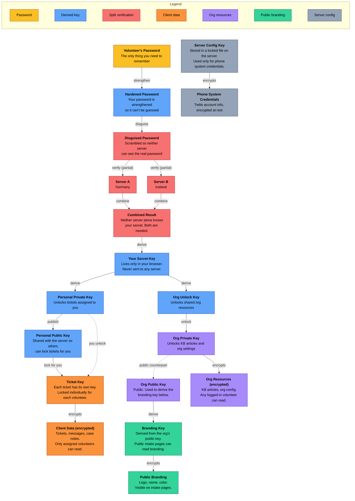
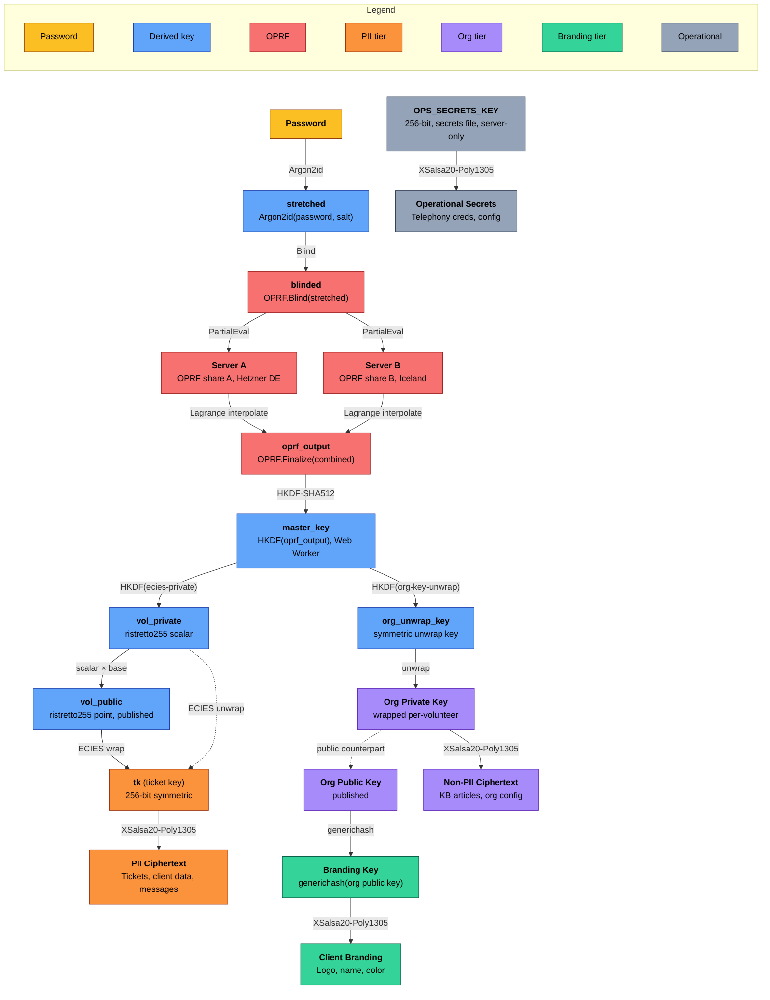

# CARE-Y

**Care Anonymized, Redacted, Encrypted - ████**

> **Pre-alpha.** This project is under active development. No code has been released yet.

CARE-Y is a call intake and support system for at-risk populations actively targeted by powerful groups. It serves mutual-aid nonprofits where clients' identity, contact information, and case details are dangerous in the wrong hands.

CARE-Y is a full rewrite of the Katie call intake system from DARIA Engineering (Django 2.2, Twilio, Heroku) with **security-first architecture**.

End-to-end encrypted, self-hosted, provider-agnostic telephony.

---

## Why CARE-Y Exists

CARE-Y makes bulk decryption architecturally impossible. The server stores only ciphertext and ECIES-wrapped ticket keys. Decryption keys are derived via a split-key OPRF protocol (RFC 9497) across two servers in separate jurisdictions. It **cannot decrypt PII alone** because decryption requires the volunteer's password plus OPRF evaluation from both servers. No single server can derive the decryption key. A subpoena to one hosting provider yields encrypted blobs and a single unusable OPRF share.

**Threat model:**

- Database breach (full dump of all tables)
- Subpoena to hosting provider
- Subpoena to telephony provider (Twilio/SignalWire)
- Compromised volunteer device
- Rogue admin with server access
- State-level adversary with legal compulsion powers

---

## Architecture

```
CLIENT (browser)                    SERVER (API)
────────────────                    ────────────
All encrypt/decrypt happens here    Stores only ciphertext
Keys derived via OPRF at login      Routes requests, manages auth
Crypto runs in Web Worker           Stateless relay for telephony
                                    Holds OPRF share (evaluated at login)
                                    Wraps tk via ECIES to volunteer public keys
```

Each organization gets an isolated PostgreSQL schema. Cross-org queries are structurally impossible at the SQL layer, not just access-controlled.

### How Your Data Is Protected

CARE-Y encrypts everything before it leaves the volunteer's browser. The server stores only scrambled data it cannot read. Even if someone seizes the server, they get nothing usable.



**What this means in practice:**

| What's protected | Who can read it | What an attacker gets if they seize the server |
| --- | --- | --- |
| **Client data** (tickets, messages, case notes) | Only the specific volunteers assigned to that ticket | Nothing. Decryption requires the volunteer's password AND both servers in two countries cooperating. No single seizure is enough. |
| **Org resources** (KB articles, settings) | Any logged-in volunteer in that org | Nothing. Still requires a volunteer's password to unlock. |
| **Public branding** (logo, name, color) | Anyone who visits the intake page | Visual identity only. This is intentionally public so clients recognize the org. |
| **Phone credentials** (Twilio config) | The server itself (automated) | Phone system API access only. No client data, no volunteer keys. |

**Key guarantees:**

- **The server cannot read client data.** All decryption happens in the volunteer's browser. The server stores scrambled data it cannot unscramble.
- **No single country can force decryption.** The two verification servers are in different countries (Germany and Iceland). A court order in one country only gets half the puzzle.
- **The split changes daily.** Even if someone captures one server's half, it expires within 24 hours.
- **Phone calls and texts are not stored.** Outbound messages pass through the server and are erased from memory immediately. The server never saves them.
- **Inbound texts are encrypted on arrival.** The phone provider keeps its own copy for ~30 days (federal law requires this for all phone providers), but CARE-Y's copy is encrypted the moment it arrives.
- **Escrow for emergencies.** Four separate recovery keys are stored on offline USB drives held by different people. If both servers are lost, the org can recover.

---

- **Web intake forms and case notes:** true end-to-end encryption. Plaintext never reaches the server.
- **Outbound SMS/calls:** volunteer's browser decrypts, sends to one-shot relay endpoint, server forwards to telephony provider and zeros the buffer immediately. Never stored, never logged.
- **Inbound SMS:** encrypted on receipt, plaintext purged. Telephony provider retains independently (~30 days).
- **Telephony abstraction:** Twilio initially, SignalWire hybrid (self-hosted voice) planned. Provider swap, not rewrite.

---

<details>
<summary><b>E2EE Technical details</b></summary>

#### Key Hierarchy (Dual-Tier, OPRF-Based)

CARE-Y uses a dual-tier encryption model. PII (tickets, client data) is protected by OPRF-based split-key derivation: the volunteer's password is hardened via a threshold OPRF protocol across two servers in separate jurisdictions, producing a `masterKey` that derives per-volunteer ECIES keys. No per-ticket server round-trip is needed for decryption. Non-PII shared resources (KB articles, org config) use a standard wrapped org key.



| Tier | Data | Decryption requires | What's exposed if compromised |
| ---- | ---- | ------------------- | ----------------------------- |
| **PII** (OPRF + ECIES) | Tickets, client data, messages | OPRF-derived `masterKey` (via volunteer password + both OPRF servers) + ECIES per-volunteer wrapping of `tk`. No per-ticket server round-trip. | Nothing. No single server holds enough to decrypt PII. |
| **Non-PII** (org key) | KB articles, org config | Volunteer's `org_unwrap_key` (derived from `masterKey`) to unwrap org private key | Org configuration only. No PII. |
| **Client branding** | Public-facing branding | Org public key (intentionally public) | Visual assets only (logo, name, color). Already public by design. |
| **Operational** | Telephony creds, provider config | `OPS_SECRETS_KEY` (server secrets file) | Telephony provider API access only. No volunteer key material. |

**How PII decryption works (per ticket):**

1. At login, volunteer derives `masterKey` via OPRF (password -> Argon2id -> OPRF evaluation from both servers -> HKDF)
2. Web Worker derives `volPrivate` from `masterKey` (one-time, cached for session)
3. To view a ticket, Worker fetches the ECIES-wrapped `tk` from `ticket_key_wraps` via tRPC
4. Worker unwraps `tk` using ECIES: computes shared secret from `volPrivate` and the stored ephemeral point, derives K, decrypts `tk`
5. Worker decrypts ticket content with `tk` (XSalsa20-Poly1305)
6. Plaintext exists only in the Worker's memory for the duration of the session. No server round-trip per ticket.

**Seizure resistance:** OPRF key is split across two servers in separate jurisdictions (EU + non-EU). Shares are refreshed every 24 hours. A seized share from one epoch is useless in the next. See `docs/design-ref/crypto-architecture-v2.md` section 9.

**Post-quantum hybrid:** Classical OPRF at launch. HKDF interface designed for ML-KEM-768 hybrid layer (v1.1). The system is secure if either classical OPRF or ML-KEM holds.

**Escrow:** Four separate passphrase-encrypted escrow files on separate offline USB drives, held by different custodians: (1) OPRF key (full key reconstructed from shares for escrow only), (2) org private key, (3) `OPS_SECRETS_KEY`, (4) [future] ML-KEM master. Never bundled.

</details>

## Tech Stack

| Layer           | Technology                                                                   |
| --------------- | ---------------------------------------------------------------------------- |
| Language        | TypeScript (ESM, `strict: true`)                                             |
| Frontend        | SvelteKit (Svelte 5 runes) + Konsta UI (mobile) + Bits UI (accessible forms) |
| API             | tRPC (end-to-end type safety) + TanStack Query (caching)                     |
| Database        | PostgreSQL + Kysely (SQL query builder, manual migrations)                   |
| Crypto          | libsodium (`libsodium-wrappers-sumo` browser, `sodium-native` Node)           |
| Testing         | Vitest + fast-check (property-based) + Playwright + axe-core (a11y)          |
| Telephony       | Twilio (initial) → SignalWire (future, self-hosted voice)                    |
| Hosting         | Hetzner VPS (EU), LUKS full-disk encryption, Caddy reverse proxy             |
| Package manager | pnpm (strict, workspace monorepo)                                            |
| Real-time       | SSE (server-sent events, metadata only, never encrypted content)             |

---

## Monorepo Structure

```
packages/
  client/      - SvelteKit web app (volunteer + admin + client portal)
  server/      - Node.js + tRPC API, auth, webhooks, relay endpoints
  crypto/      - Shared isomorphic encryption library (browser + Node)
  shared/      - Shared types, Zod schemas, enums
```

---

## Prerequisites

Before setting up the development environment, ensure you have:

| Tool         | Version  | Install                                                                                                                                 |
| ------------ | -------- | --------------------------------------------------------------------------------------------------------------------------------------- |
| **Node.js**  | 22.x LTS | [nvm](https://github.com/nvm-sh/nvm) or [nvm-windows](https://github.com/coreybutler/nvm-windows)                                       |
| **pnpm**     | 10.x     | `corepack enable && corepack prepare pnpm@latest --activate`                                                                            |
| **Docker**   | Latest   | [Docker Desktop](https://www.docker.com/products/docker-desktop/) (for PostgreSQL)                                                      |
| **Gitleaks** | Latest   | `scoop install gitleaks` (Windows) / `brew install gitleaks` (macOS) / [GitHub releases](https://github.com/gitleaks/gitleaks/releases) |

---

## Security

See [SECURITY.md](SECURITY.md) for vulnerability reporting.

Key security principles:

- **Server cannot decrypt alone:** PII decryption requires the volunteer's password plus OPRF evaluation from both servers. No single server can derive the decryption key.
- **E2E for all client-authored content:** encrypted in the browser before transmission
- **Telephony relay zeroes memory:** `Buffer.fill(0)` in `finally` blocks, no strings, no logging
- **Webhook signatures always validated**, even in development
- **2FA mandatory:** all volunteers, all environments
- **EU hosting:** Hetzner VPS, LUKS full-disk encryption, outside US legal jurisdiction

---

## License

AGPL-3.0-only. See [LICENSE](LICENSE) for details.

CARE-Y supports both hosted multi-tenant deployment and self-hosted single-tenant deployment from the same codebase. Self-hosted instances use BYOT (bring your own telephony) configuration.
