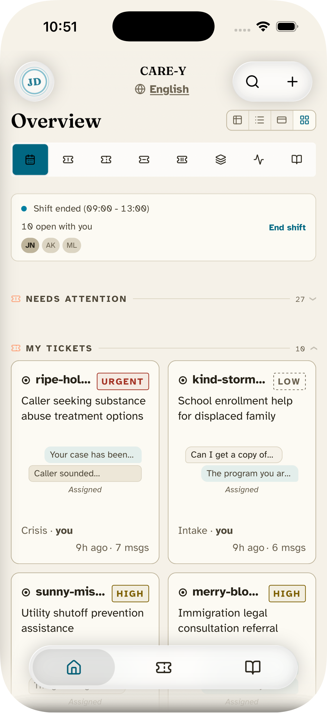
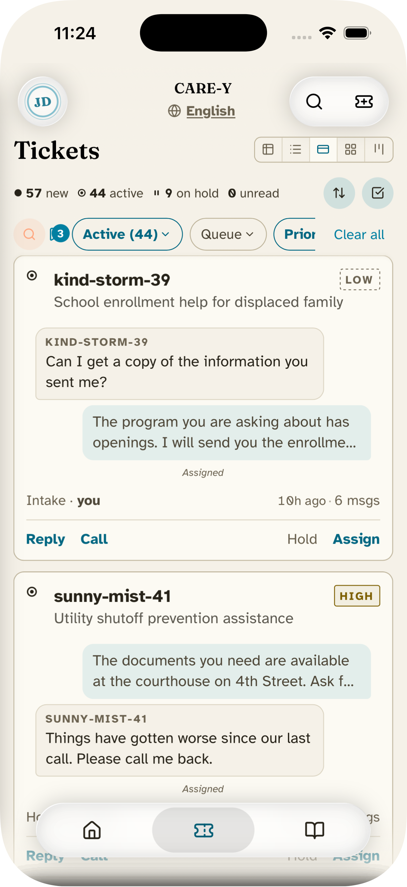
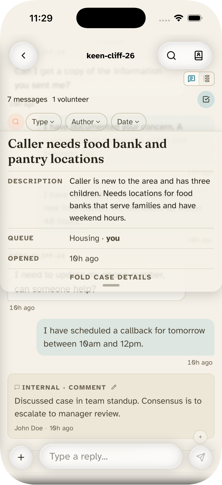
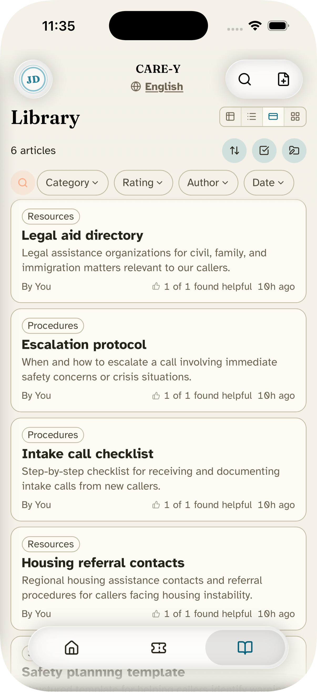
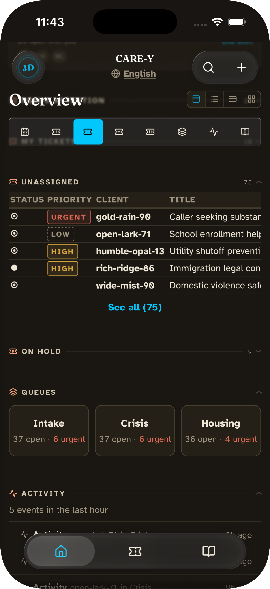
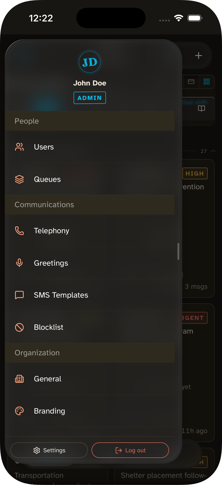
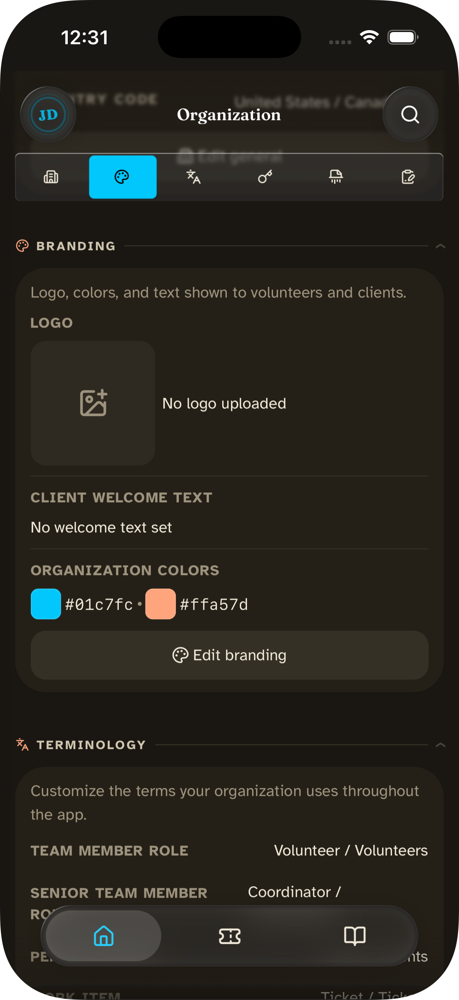
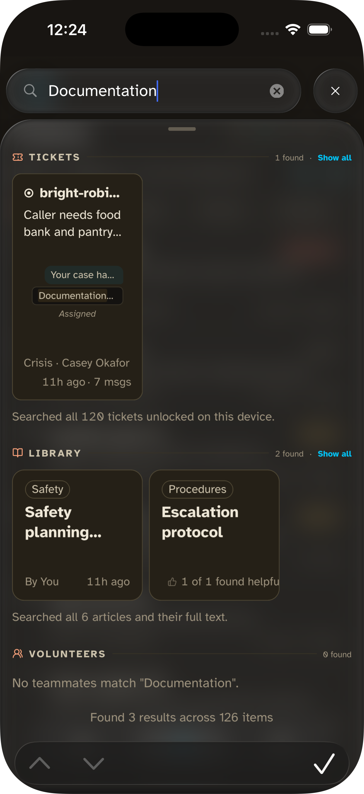
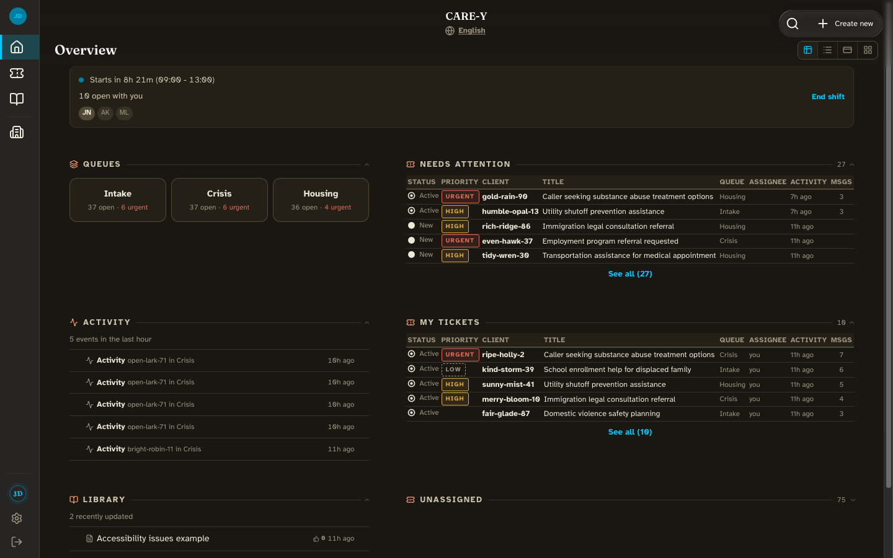
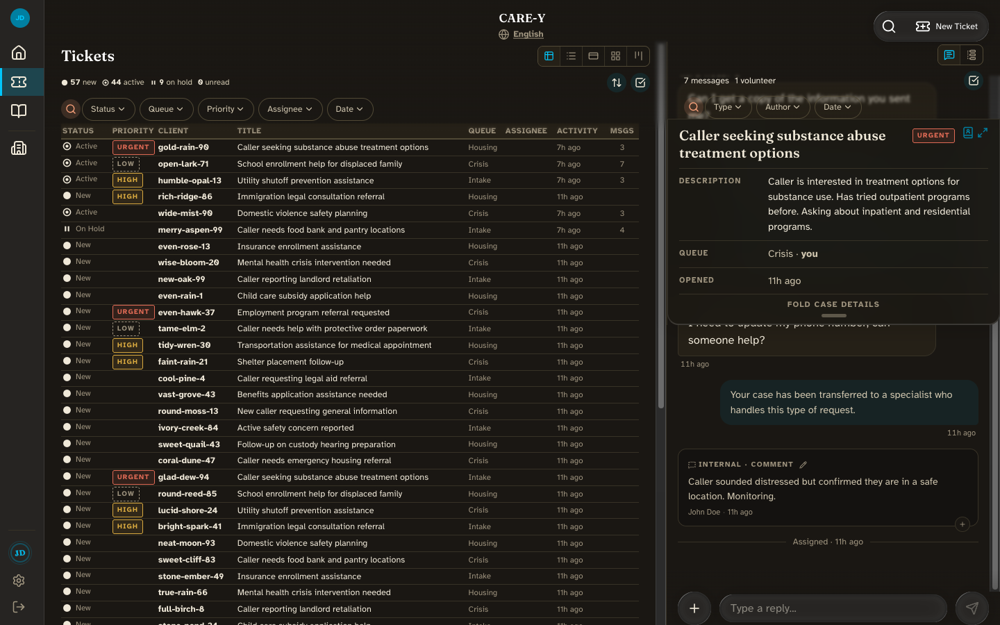

# CARE-Y

**Care Anonymized, Redacted, Encrypted - ████**

> **Pre-alpha.** Under active development. Not yet released.

A call intake and case management system for mutual aid organizations serving at-risk populations. Both clients and volunteers face real danger if their identities or case details are exposed. CARE-Y is built so that even a seized server reveals nothing about who sought help or who provided it.

<p align="center">
  
  
  
  
</p>

---

## What is CARE-Y?

CARE-Y is built for organizations where a database breach or legal subpoena could put real people in danger. Volunteers use CARE-Y to receive calls, manage cases, and coordinate responses through a mobile-first PWA. All client data is encrypted in the volunteer's browser before it reaches the server. The server stores ciphertext it cannot read.

The system is designed for small mutual aid nonprofits. These groups handle sensitive information with limited technical resources, and a data breach can have devastating consequences to both the members of the organization and the people they provide aid to.

CARE-Y runs as a multi-tenant hosted service or a self-hosted single-tenant instance from the same codebase. Self-hosted deployments use BYOT (bring your own telephony) configuration.

---

## Why CARE-Y Exists

If a server can read the data it stores, so can anyone who compromises or subpoenas that server. For organizations where a breach means real people could get hurt, that is not an acceptable tradeoff.

CARE-Y makes that scenario architecturally impossible. The server stores only ciphertext and encrypted key material. Decryption requires the volunteer's password plus cryptographic evaluation from two independent servers in separate legal jurisdictions. A breach of any one component produces nothing readable. A subpoena to one hosting provider gets encrypted blobs and a single unusable key share.

**Threat model:**

- Database breach (full dump of all tables)
- Subpoena to hosting provider
- Subpoena to telephony provider (Twilio/SignalWire)
- Compromised volunteer device
- Rogue admin with server access
- State-level adversary with legal compulsion powers
- Network surveillance (identifying who connects to the service)

---

## Features

<p align="center">
  
  
  
  
</p>

<p align="center">
  
  
</p>

- **Encrypted case management.** Tickets, messages, case notes, and client data are encrypted with per-ticket keys in the browser before reaching the server.
- Inbound texts are **encrypted on arrival**. Outbound messages pass through a stateless relay that zeros memory after forwarding.
- **Knowledge base** with rich text articles, categories, voting, and search. Content encrypted with the org key before reaching the server.
- **Queue-based routing.** Tickets go into org-defined queues with priority levels and assignment workflows.
- Unified **search** across tickets, knowledge base articles, and volunteers from a single interface.
- **Role-based access.** Volunteer, Manager, and Admin roles with granular permissions. Encryption key status visible per user.
- Installable **PWA** with dark mode and offline asset caching. The service worker never caches encrypted content.
- **i18n** via Paraglide JS (compile-time, tree-shaken). English and Spanish included.

---

## Accessibility and Language

CARE-Y serves populations with varied technical backgrounds and language needs.

- **WCAG AA contrast enforcement.** Each org sets its own brand colors. A contrast engine adjusts them at runtime to meet 4.5:1 ratios in both light and dark mode.
- **Focus management.** Modal sheets and dialogs use focus traps with Tab/Shift+Tab wrapping and focus restoration on dismiss. Keyboard activation (Enter/Space) on all interactive elements.
- **Reduced motion.** Animations respect `prefers-reduced-motion`. Users who need reduced motion get static alternatives.
- **Increased contrast.** `prefers-contrast: more` is respected across all interactive elements.
- **Screen reader support.** All interactive elements carry ARIA labels. Dynamic content changes are announced, and visual-only cues have text equivalents.
- **Multilingual.** English and Spanish translations via Paraglide JS (compile-time, tree-shaken). Adding a new language requires only adding JSON file.

---

## Exposure System

Many of CARE-Y's users are not technical. The Exposure system teaches security through the volunteer's own session instead of a training module.

**What the system protects.** CARE-Y encrypts all client data in the browser. The server stores ciphertext it cannot read. The Exposure system explains this in plain language so volunteers understand what is protected and why it matters.

**How much of that protection the volunteer is using.** Some protections are architectural and always active (encryption). Others depend on choices the volunteer or their admin makes. A hardware security key prevents phishing. A Tor connection hides who is using the service. Self-hosted voice keeps call audio off third-party servers. The Exposure system shows which protections are active and what can be done to turn on the rest.

**What the system cannot protect.** A compromised device or a malicious browser extension can read decrypted content, and CARE-Y cannot prevent that. The onboarding walkthrough and login summary name these risks directly and tell volunteers what to do about them. Contextual notifications reinforce this at the moment it matters. Opening an SMS-originated ticket, for example, reminds the volunteer that the original text passed through the phone provider before it was encrypted.

The Exposure system is under active development.

---

## Client Portal

The client-facing intake form and portal use a three-tier communication model. Clients choose their level of protection based on their device capabilities and risk tolerance.

- **SMS/Email (default).** Works on any phone. Org-side storage is encrypted, but the SMS/email channel itself is plaintext.
- **Secure Link.** Volunteer generates a portal link with cryptographic key material in the URL fragment (never sent to the server, per RFC 3986). Client reads and sends messages in the browser with no account or password required. Optional link passphrase adds a second factor for high-risk clients.
- **Encrypted Account.** Client creates an account with a password. Password derives a keypair, messages encrypted end-to-end. This is the strongest option for high-risk clients. All communication goes through the client portal. Text and email notifications send only "You have a new message" with a sign-in link. A Twilio or email subpoena gets only a login URL.

The tiers differ in channel protection, not in service quality. Clients are told what each tier's protection level means.

The client portal is under active development.

---

## How Your Data Is Protected

CARE-Y encrypts data in the volunteer's browser. The server stores only ciphertext it cannot read.


**Protection by data type:**

| What's protected                                | Who can read it                                      | What an attacker gets if they seize the server                                                                                    |
| ----------------------------------------------- | ---------------------------------------------------- | --------------------------------------------------------------------------------------------------------------------------------- |
| **Client data** (tickets, messages, case notes) | Only the specific volunteers assigned to that ticket | Nothing. Decryption requires the volunteer's password AND both servers in two countries cooperating. No single seizure is enough. |
| **Org resources** (KB articles, settings)       | Any logged-in volunteer in that org                  | Nothing. Still requires a volunteer's password to unlock.                                                                         |
| **Public branding** (logo, name, color)         | Anyone who visits the intake page                    | Visual identity only. This is intentionally public so clients recognize the org.                                                  |
| **Phone credentials** (Twilio config)           | The server itself (automated)                        | Phone system API access only. No client data, no volunteer keys.                                                                  |

**Key guarantees:**

- **The server cannot read client data.** All decryption happens in the volunteer's browser.
- **No single country can force decryption.** The two OPRF servers are in different countries (Germany and Iceland). A court order in one country only gets half the puzzle.
- **The split changes daily.** Even if someone captures one server's share, it expires within 24 hours.
- **Phone calls and texts are not stored.** Outbound messages pass through the server and are erased from memory immediately.
- **Inbound texts are encrypted on arrival.** The phone provider retains its own copy for ~30 days (federal law), but CARE-Y's copy is encrypted the moment it arrives.
- **Escrow for emergencies.** Four separate recovery keys on offline USB drives held by different custodians.

<details>
<summary><b>E2EE Technical Details</b></summary>

#### Key Hierarchy (Dual-Tier, OPRF-Based)

CARE-Y uses a dual-tier encryption model. PII (tickets, client data) is protected by OPRF-based split-key derivation. The volunteer's password is hardened via a threshold OPRF protocol across two servers in separate jurisdictions, producing a `masterKey` that derives per-volunteer ECIES keys. No per-ticket server round-trip is needed for decryption. Non-PII shared resources (KB articles, org config) use a standard wrapped org key.


| Tier                   | Data                                                                      | Decryption requires                                                                                                                            | What's exposed if compromised                                                                                                         |
| ---------------------- | ------------------------------------------------------------------------- | ---------------------------------------------------------------------------------------------------------------------------------------------- | ------------------------------------------------------------------------------------------------------------------------------------- |
| **PII** (OPRF + ECIES) | Tickets, client data, messages                                            | OPRF-derived `masterKey` (via volunteer password + both OPRF servers) + ECIES per-volunteer wrapping of `tk`. No per-ticket server round-trip. | Nothing. No single server holds enough to decrypt PII.                                                                                |
| **Non-PII** (org key)  | KB articles, org config                                                   | Volunteer's `org_unwrap_key` (derived from `masterKey`) to unwrap org private key                                                              | Org configuration only. No PII.                                                                                                       |
| **Client branding**    | Public-facing branding                                                    | Org public key (intentionally public)                                                                                                          | Visual assets only (logo, name, color). Already public by design.                                                                     |
| **Operational**        | Telephony creds, provider config, volunteer identifiers, session metadata | `OPS_SECRETS_KEY` (server secrets file)                                                                                                        | Telephony API access and encrypted volunteer/session metadata. No volunteer key material. Full server compromise required to decrypt. |

**How PII decryption works (per ticket):**

1. At login, volunteer derives `masterKey` via OPRF (password -> Argon2id -> OPRF evaluation from both servers -> HKDF)
2. Web Worker derives `volPrivate` from `masterKey` (one-time, cached for session)
3. To view a ticket, Worker fetches the ECIES-wrapped `tk` from `ticket_key_wraps` via tRPC
4. Worker unwraps `tk` using ECIES: computes shared secret from `volPrivate` and the stored ephemeral point, derives K, decrypts `tk`
5. Worker decrypts ticket content with `tk` (XSalsa20-Poly1305)
6. Plaintext exists only in the Worker's memory for the duration of the session. No server round-trip per ticket.

**Seizure resistance:** OPRF key is split across two servers in separate jurisdictions (EU + non-EU). Shares are refreshed every 24 hours. A seized share from one epoch is useless in the next. See `docs/design-ref/crypto-architecture-v2.md` section 9.

**Post-quantum hybrid:** Classical OPRF at launch. HKDF interface designed for ML-KEM-768 hybrid layer (v1.1). The system is secure if either classical OPRF or ML-KEM holds.

**Escrow:** Four separate passphrase-encrypted escrow files on separate offline USB drives, held by different custodians: (1) OPRF key (full key reconstructed from shares for escrow only), (2) org private key, (3) `OPS_SECRETS_KEY`, (4) [future] ML-KEM master. Never bundled.

</details>

---

## Architecture

```
CLIENT (browser)                    SERVER (API)
All encrypt/decrypt happens here    Stores only ciphertext
Keys derived via OPRF at login      Routes requests, manages auth
Crypto runs in Web Worker           Stateless relay for telephony
                                    Holds OPRF share (evaluated at login)
                                    Wraps tk via ECIES to volunteer public keys
```

Each organization gets an isolated PostgreSQL schema (`org_<uuid>`). Cross-org queries are structurally impossible at the SQL layer via Kysely `.withSchema()` AST transformation. No session state, no `SET search_path`.

**Data flow:**

- **Web intake forms and case notes:** true end-to-end encryption. Plaintext never reaches the server.
- **Outbound SMS/calls:** volunteer's browser decrypts, sends to one-shot relay endpoint, server forwards to telephony provider and zeros the buffer immediately. The server does not store or log the content.
- **Inbound SMS:** encrypted on receipt, plaintext purged. Telephony provider retains independently (~30 days).
- **Telephony abstraction:** Twilio initially, SignalWire hybrid (self-hosted voice) planned. Switching providers requires configuration changes only.

---

## Tech Stack

| Layer           | Technology                                                                   |
| --------------- | ---------------------------------------------------------------------------- |
| Language        | TypeScript (ESM, `strict: true`)                                             |
| Frontend        | SvelteKit (Svelte 5 runes) + Konsta UI (mobile) + Bits UI (accessible forms) |
| Rich text       | ProseMirror (knowledge base editor)                                          |
| Styling         | Tailwind CSS v4 + Lucide icons                                               |
| API             | tRPC v11 + @tanstack/svelte-query v6 (stale-while-revalidate caching)        |
| Validation      | Zod v4 (shared schemas between client and server)                            |
| Database        | PostgreSQL + Kysely (SQL query builder, manual migrations)                   |
| Crypto          | libsodium (`libsodium-wrappers-sumo` browser, `sodium-native` Node)          |
| Sanitization    | DOMPurify (XSS protection for rendered content)                              |
| i18n            | Paraglide JS v2 (compile-time translations, tree-shaking, SSR)               |
| Testing         | Vitest + fast-check (property-based) + Playwright + axe-core (a11y)          |
| Telephony       | Twilio (initial), SignalWire (future, self-hosted voice)                     |
| Hosting         | Hetzner VPS (EU), LUKS full-disk encryption, Caddy reverse proxy             |
| PWA             | @vite-pwa/sveltekit (service worker, offline caching via Workbox)            |
| Real-time       | SSE (server-sent events, metadata only, never encrypted content)             |
| Package manager | pnpm (strict, workspace monorepo)                                            |

---

## Monorepo Structure

```
packages/
  client/      - SvelteKit web app (volunteer + admin + client portal)
  server/      - Node.js + tRPC API, auth, webhooks, relay endpoints
  crypto/      - Shared isomorphic encryption library (browser + Node)
  shared/      - Shared types, Zod schemas, enums
```

---

## Prerequisites

| Tool         | Version  | Install                                                                                                                                 |
| ------------ | -------- | --------------------------------------------------------------------------------------------------------------------------------------- |
| **Node.js**  | 22.x LTS | [nvm](https://github.com/nvm-sh/nvm) or [nvm-windows](https://github.com/coreybutler/nvm-windows)                                       |
| **pnpm**     | 10.x     | `corepack enable && corepack prepare pnpm@latest --activate`                                                                            |
| **Docker**   | Latest   | [Docker Desktop](https://www.docker.com/products/docker-desktop/) (for PostgreSQL)                                                      |
| **Gitleaks** | Latest   | `scoop install gitleaks` (Windows) / `brew install gitleaks` (macOS) / [GitHub releases](https://github.com/gitleaks/gitleaks/releases) |

---

## Status

CARE-Y is in active development. The backend (auth, crypto, telephony, ticket system) is functionally complete. The frontend volunteer app is nearing completion (design system, onboarding, dashboard, ticket views, knowledge base, and admin are built. Client portal, shift scheduling, and production infrastructure remain).

---

## Security

See [SECURITY.md](SECURITY.md) for vulnerability reporting.

Key security principles:

- **Server cannot decrypt client data.** Decryption requires the volunteer's password plus OPRF evaluation from both threshold servers.
- **E2E for all client-authored content.** Encrypted in the browser before transmission.
- **Telephony relay zeroes memory.** `Buffer.fill(0)` in `finally` blocks. Plaintext is never held as a JS string and relay requests are not logged.
- **Webhook signatures always validated**, even in development.
- **2FA mandatory for data access.** All volunteers, all environments. Authentication succeeds without 2FA, but accessing any encrypted data requires a verified second factor.
- **EU hosting.** Hetzner VPS, LUKS full-disk encryption, outside US legal jurisdiction.

---

## License

AGPL-3.0-only. See [LICENSE](LICENSE) for details.
